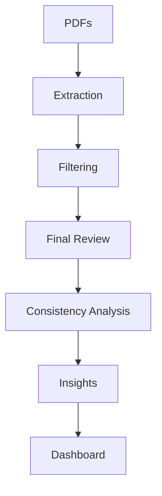

# Taiwan Semiconductor ESG Claim Analyzer

A focused Python MVP for extracting, filtering, reviewing, and presenting ESG claims from semiconductor sustainability reports.

This project is designed as a sustainable finance portfolio case study. It helps a human analyst identify ESG claims worth reviewing, especially around emissions, renewable energy, supply-chain commitments, and governance disclosures.

## MVP Scope

This is intentionally small and transparent:

- Regex-first ESG claim extraction from PDF reports
- Page-by-page PDF text extraction with `pdfplumber`
- Lightweight confidence filtering and duplicate removal
- Analyst-style final shortlist capped at 40 claims
- Simple Streamlit dashboard for review
- No agents, no vector database, no RAG, no LangChain, and no LangGraph

This project is not an official ESG rating, does not verify whether claims are true, and does not provide investment advice.

## Why This Matters

Sustainable finance analysts often need to compare company ESG statements against targets, metrics, and evidence. Sustainability reports are long, unevenly structured, and full of broad language. This MVP narrows that material into a smaller set of claims that a human reviewer can inspect more efficiently.

## Repository Structure

```text
app/                 Streamlit dashboard
assets/screenshots/  Screenshot placeholders for portfolio images
data/
  claims_template.csv
  extracted/          Generated claim outputs
docs/                 Methodology and project notes
output/               Portfolio report and demo summary
reports/              Source sustainability report PDFs
src/                  Extraction, filtering, and review pipeline
tests/                Unit tests
requirements.txt      Python dependencies
```

## Architecture



## Setup

Create and activate a virtual environment:

```bash
python -m venv .venv
.venv\Scripts\activate
```

Install dependencies:

```bash
pip install -r requirements.txt
```

Run tests:

```bash
python -m pytest -q
```

## Run the Pipeline

Extract claim candidates and create the filtered analyst file:

```bash
python -m src.run_extraction --progress
```

The default command expects PDFs in `data/reports`, parses the in-scope TSMC and ASEH reports, and uses two document workers. To run with explicit paths or settings, use:

```bash
python -m src.run_extraction --reports-dir data/reports --template data/claims_template.csv --output-dir data/extracted --min-confidence 0.65 --workers 2
```

Use `--workers 1 --progress` for page-level progress logging, or `--include-unsupported` to parse every PDF in the reports folder.

Create the final 40-claim shortlist:

```bash
python -m src.review_claims
```

Evaluate ESG claim specificity, measurability, evidence strength, and consistency:

```bash
python -m src.consistency_analysis
```

Generate readable analyst insights from the consistency analysis:

```bash
python -m src.insights_summary
```

Launch the dashboard:

```bash
streamlit run app/dashboard.py
```

## Outputs

Generated data files:

- `data/extracted/all_claim_candidates.json`: all regex-detected ESG claim candidates
- `data/extracted/filtered_claims.csv`: confidence-filtered claims with risk labels
- `data/extracted/final_claims.csv`: final analyst shortlist, capped at 40 claims
- `data/extracted/consistency_analysis.csv`: rule-based specificity, measurability, evidence, consistency, and review-priority analysis

Portfolio artifacts:

- `output/project_report.md`: concise written project report
- `output/demo_summary.md`: short demo explanation
- `output/insights_summary.md`: readable analyst insights from the consistency analysis

## Example Outputs

Current generated output from the sample reports:

- `513` raw claim candidates
- `231` filtered claims
- `40` final shortlisted claims
- Final risk mix: `33 Medium`, `5 High`, `2 Low`
- Consistency mix after stricter review: `2 Strong`, `16 Moderate`, `22 Weak`

Example final output columns:

```text
company, category, claim, page, confidence_score, risk_level, risk_reason, analyst_note
```

Example claim categories:

- `emissions`
- `renewable_energy`
- `supply_chain`
- `governance`

## Dashboard

The dashboard reads `data/extracted/final_claims.csv` and uses `data/extracted/consistency_analysis.csv` when available. It includes:

- Overview with KPI cards
- Analyst Insights
- Company comparison
- Consistency Analysis
- Claims Explorer with search, filters, and expandable claim detail
- Methodology
- Charts for consistency, review priority, category coverage, and review priority by company
- Color-coded consistency and review-priority badges

## Screenshots

Place screenshots here after recording the project demo:

### Dashboard Overview

`assets/screenshots/dashboard-overview.png`

### Claims Table

`assets/screenshots/claims-table.png`

### Risk Breakdown

`assets/screenshots/risk-breakdown.png`

## Methodology

The pipeline uses local PDF extraction and transparent rule-based processing:

1. Extract report text page by page with `pdfplumber`.
2. Detect ESG claim candidates with regex patterns.
3. Compare candidates against `data/claims_template.csv`.
4. Score confidence using category keywords, claim signals, numeric evidence, and template similarity.
5. Filter generic marketing language and near-duplicate claims.
6. Assign simple risk labels based on metrics, target years, and validation signals.
7. Rank the strongest claims into a final analyst shortlist.
8. Apply consistency analysis for specificity, measurability, evidence strength, and internal consistency flags.
9. Generate a rule-based analyst insights summary from the consistency output.

Risk labels are intentionally simple:

- `Low`: claim includes a specific metric, target year, and evidence or validation language.
- `Medium`: claim is specific but missing a metric, target year, or validation signal.
- `High`: claim is vague or aspirational without a measurable KPI.

Consistency flags are also rule-based:

- `Strong`: clear KPI, target/reporting year, quantitative value, and standard or validation reference.
- `Moderate`: some measurable detail, but missing a target year, quantitative value, or external validation.
- `Weak`: broad or aspirational claim with limited KPI, implementation detail, target year, or validation evidence.

Review priorities are derived from the consistency flag:

- `High Review Priority`: Weak claims
- `Medium Review Priority`: Moderate claims
- `Low Review Priority`: Strong claims

## Limitations

- This is an MVP, not a production ESG system.
- Regex extraction can miss claims in tables, charts, footnotes, or unusual layouts.
- PDF text extraction can create broken sentence fragments.
- Company names may require normalization when inferred from filenames.
- The pipeline does not verify claims against external sources.
- The output assists human sustainable finance analysis; it is not automated investment advice.

## Future Improvements

- Normalize company names, report years, and source document metadata.
- Improve table extraction for quantitative ESG disclosures.
- Add manual review flags for PDF layout artifacts.
- Validate claims against SBTi, CDP, assurance statements, and regulatory filings.
- Add a small human-reviewed evaluation set for precision and recall.

## Current MVP Output

The current MVP produces a final 40-claim shortlist and a Streamlit dashboard for review. It is ready for portfolio demonstration as a transparent, human-in-the-loop ESG claim analysis workflow.
